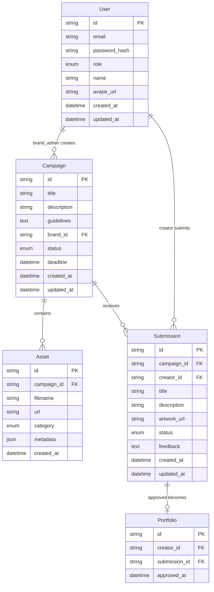

# FanForge Architecture RFC

## Overview

This RFC outlines the technical architecture for FanForge, a collaborative platform connecting IP owners with fan creators through sanctioned derivative content creation campaigns. The architecture supports the core workflows of campaign creation, asset management, creation canvas, and submission review.

## System Architecture

### Frontend Architecture

- **Framework:** React 18 with Next.js 14 App Router
- **Language:** TypeScript 5.0
- **Styling:** Tailwind CSS 3.3 with shadcn/ui components
- **State Management:** React Hooks (useState, useReducer, useContext)
- **Routing:** Next.js App Router with route groups
- **Build Tool:** Next.js built-in bundler with Turbopack

### Data Layer

- **API Layer:** Mock REST APIs with JSON responses
- **Client State:** React Hook Form for form state, Context API for global state
- **Data Validation:** Zod schemas for type-safe validation
- **File Handling:** Browser File API with mock upload endpoints

### Deployment Architecture

- **Hosting:** Vercel static hosting
- **Build:** Next.js static export
- **CDN:** Vercel Edge Network
- **Assets:** Public folder with placeholder images

## Entity Relationship Diagram



## API Contract Specification

### Authentication Endpoints

#### POST /api/auth/register

```json
{
  "request": {
    "email": "string",
    "password": "string",
    "role": "creator | brand_admin",
    "name": "string"
  },
  "response": {
    "user": {
      "id": "string",
      "email": "string",
      "role": "string",
      "name": "string"
    },
    "token": "string"
  }
}
```

#### POST /api/auth/login

```json
{
  "request": {
    "email": "string",
    "password": "string"
  },
  "response": {
    "user": {
      "id": "string",
      "email": "string",
      "role": "string",
      "name": "string"
    },
    "token": "string"
  }
}
```

### Campaign Endpoints

#### GET /api/campaigns

```json
{
  "query": {
    "search": "string?",
    "category": "string?",
    "status": "active | draft | closed?",
    "page": "number?",
    "limit": "number?"
  },
  "response": {
    "campaigns": [
      {
        "id": "string",
        "title": "string",
        "description": "string",
        "brand_name": "string",
        "status": "string",
        "deadline": "datetime",
        "asset_count": "number",
        "submission_count": "number",
        "thumbnail_url": "string"
      }
    ],
    "pagination": {
      "page": "number",
      "limit": "number",
      "total": "number",
      "pages": "number"
    }
  }
}
```

#### POST /api/campaigns

```json
{
  "request": {
    "title": "string",
    "description": "string",
    "guidelines": "string",
    "deadline": "datetime",
    "assets": [
      {
        "filename": "string",
        "category": "characters | backgrounds | logos | titles | props",
        "file": "File"
      }
    ]
  },
  "response": {
    "campaign": {
      "id": "string",
      "title": "string",
      "status": "draft",
      "created_at": "datetime"
    }
  }
}
```

#### GET /api/campaigns/[id]

```json
{
  "response": {
    "campaign": {
      "id": "string",
      "title": "string",
      "description": "string",
      "guidelines": "string",
      "brand_name": "string",
      "status": "string",
      "deadline": "datetime",
      "created_at": "datetime",
      "assets": [
        {
          "id": "string",
          "filename": "string",
          "url": "string",
          "category": "string",
          "metadata": "object"
        }
      ]
    }
  }
}
```

### Submission Endpoints

#### POST /api/submissions

```json
{
  "request": {
    "campaign_id": "string",
    "title": "string",
    "description": "string",
    "artwork": "File",
    "notes": "string?"
  },
  "response": {
    "submission": {
      "id": "string",
      "campaign_id": "string",
      "title": "string",
      "status": "pending",
      "created_at": "datetime"
    }
  }
}
```

#### GET /api/submissions

```json
{
  "query": {
    "campaign_id": "string?",
    "creator_id": "string?",
    "status": "pending | approved | rejected?",
    "page": "number?",
    "limit": "number?"
  },
  "response": {
    "submissions": [
      {
        "id": "string",
        "campaign_title": "string",
        "creator_name": "string",
        "title": "string",
        "status": "string",
        "artwork_url": "string",
        "created_at": "datetime"
      }
    ]
  }
}
```

#### PUT /api/submissions/[id]/review

```json
{
  "request": {
    "status": "approved | rejected",
    "feedback": "string?"
  },
  "response": {
    "submission": {
      "id": "string",
      "status": "string",
      "feedback": "string",
      "reviewed_at": "datetime"
    }
  }
}
```

## Component Architecture

### Route Structure

```
app/
├── (auth)/
│   ├── login/page.tsx
│   └── register/page.tsx
├── (brand)/
│   ├── dashboard/page.tsx
│   ├── campaigns/
│   │   ├── page.tsx
│   │   ├── create/page.tsx
│   │   └── [id]/page.tsx
│   └── submissions/page.tsx
├── (creator)/
│   ├── discover/page.tsx
│   ├── campaigns/[id]/page.tsx
│   ├── create/[campaignId]/page.tsx
│   └── portfolio/page.tsx
├── layout.tsx
└── page.tsx
```

### Component Hierarchy

```
App Layout
├── Navigation (role-based)
├── Main Content
│   ├── Dashboard (Creator/Brand)
│   ├── Campaign Management
│   │   ├── Campaign List
│   │   ├── Campaign Form
│   │   └── Campaign Details
│   ├── Creation Canvas
│   │   ├── Asset Palette
│   │   ├── Canvas Area
│   │   └── Properties Panel
│   ├── Submission Review
│   │   ├── Submission Queue
│   │   ├── Review Panel
│   │   └── Feedback Form
│   └── Portfolio
│       ├── Approved Works
│       └── Submission History
└── Footer
```

## Data Models

### User Model

```typescript
interface User {
  id: string
  email: string
  role: "creator" | "brand_admin"
  name: string
  avatar_url?: string
  created_at: Date
  updated_at: Date
}
```

### Campaign Model

```typescript
interface Campaign {
  id: string
  title: string
  description: string
  guidelines: string
  brand_id: string
  brand_name: string
  status: "draft" | "active" | "closed"
  deadline: Date
  assets: Asset[]
  created_at: Date
  updated_at: Date
}
```

### Asset Model

```typescript
interface Asset {
  id: string
  campaign_id: string
  filename: string
  url: string
  category: "characters" | "backgrounds" | "logos" | "titles" | "props"
  metadata: {
    width: number
    height: number
    file_size: number
    mime_type: string
  }
  created_at: Date
}
```

### Submission Model

```typescript
interface Submission {
  id: string
  campaign_id: string
  creator_id: string
  title: string
  description: string
  artwork_url: string
  status: "pending" | "approved" | "rejected"
  feedback?: string
  created_at: Date
  updated_at: Date
}
```

## Security Considerations

### Authentication & Authorization

- JWT token-based authentication (mocked)
- Role-based access control (RBAC)
- Route protection based on user roles
- Session management with token expiration

### Data Validation

- Client-side validation with Zod schemas
- Form validation with React Hook Form
- File upload validation (type, size limits)
- Input sanitization for XSS prevention

### File Handling

- Secure file upload with type validation
- File size limits and compression
- Placeholder image system for demo
- Asset URL generation and access control

## Performance Optimization

### Frontend Performance

- Code splitting with Next.js App Router
- Component lazy loading
- Image optimization with Next.js Image
- CSS optimization with Tailwind purging

### Caching Strategy

- Static generation for public pages
- Client-side caching for API responses
- Browser caching for static assets
- Service worker for offline functionality

### Bundle Optimization

- Tree shaking for unused code elimination
- Dynamic imports for heavy components
- Webpack bundle analysis
- Compression and minification

## Monitoring & Observability

### Error Tracking

- Client-side error boundaries
- Console error logging
- User feedback collection
- Performance monitoring

### Analytics

- User interaction tracking
- Feature usage analytics
- Performance metrics collection
- Conversion funnel analysis

## Technology Stack Validation

This architecture aligns with the technical requirements:

- **Frontend:** React 18 + Next.js 14 App Router + TypeScript ✓
- **Styling:** Tailwind CSS + shadcn/ui ✓
- **Icons:** Lucide React ✓
- **State Management:** React Hooks ✓
- **Deployment:** Vercel static hosting ✓
- **Package Manager:** npm ✓
